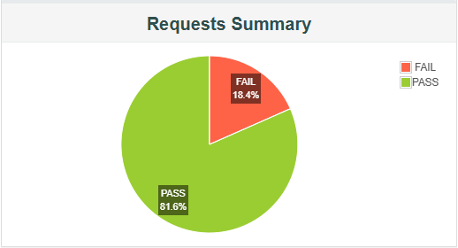

# Portafolio de Pruebas de Performance con JMeter 🚀

Este repositorio contiene ejemplos prácticos de pruebas de **carga, estrés y rendimiento**
realizados con **Apache JMeter**. El objetivo es mostrar un portafolio técnico con diferentes
escenarios que simulan servicios de autenticación, consulta y actualización de datos.

---

## 📂 Contenido del Repositorio

- **/test-plans** → Planes de prueba en JMeter (`.jmx`) organizados por servicio.
- **/results** → Reportes en PDF con evidencias de ejecución.
- **/docs** → Documentación técnica y guías de uso.
- **/assets** → Diagramas e imágenes de soporte.

---

## 🔑 Servicios Simulados

1. **Login** → Generación de token de autenticación.  
2. **Consultar valores (GET)** → Petición de datos disponibles.  
3. **Insertar valores (POST)** → Registro de nuevos elementos.  
4. **Actualizar valores (PUT)** → Modificación completa de datos.  
5. **Actualizar tarifa (PATCH)** → Modificación parcial de un valor.  
6. **Plan general** → Flujo completo integrando todos los servicios.  

---

## 📊 Ejemplo de Resultados



Los reportes completos de cada ejecución están disponibles en la carpeta `/results`.

---

## 🛠️ Cómo ejecutar los test plans

1. Clonar este repositorio:  
   ```bash
   (https://github.com/HugoRuiz10/JMeter-Performance-Portfolio-Hugo.git)
✍️ Autor: Hugo Ruiz
📧 Contacto: hmruizhernandez@gmail.com
🌐 LinkedIn: (https://www.linkedin.com/in/hugo-manuel-ruiz-hernandez-92861319a/)
